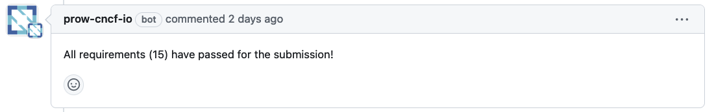

# verify-conformance

> a GitHub bot for verifying conformance submissions on github.com/cncf/k8s-conformance

The behaviour of the bot is described here, in [Gherkin](https://cucumber.io/docs/gherkin/).  Each scenario is a requirement a PR must meet to qualify for conformance.

Note: the line immediately beneath the scenario is the comment posted to the PR if the requirement is not met.

See the feature scenarios, [in ./kodata/features](./kodata/features/verify-conformance.feature).

# Developing

for more, read [the development docs](./docs/development.md).

# Docs

read the docs [here](./docs/README.md).

